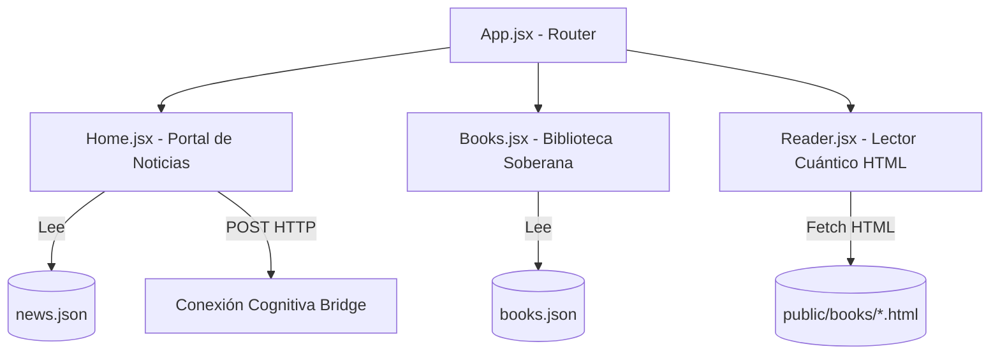

# 🏗️ Arquitectura del Nexo Ágora

Este documento describe la arquitectura de software detrás del **Gravity News Portal** y cómo interactúa con el ecosistema backend local (*Gravity AI Bridge*).

## 1. Topología del Ecosistema

El sistema se divide fundamentalmente en dos bloques totalmente desacoplados:

### A. Frontend React (El Portal)
Es una aplicación estática Single Page Application (SPA) desarrollada con **Vite + React**. 
- **Alojamiento:** Netlify.
- **Enrutamiento:** `react-router-dom` con configuración genérica (`public/_redirects`) para evitar errores 404 al refrescar las sub-rutas (`/books`, `/book/:id`).
- **Data Source Local:** Se nutre estáticamente de `src/data/news.json` y `src/data/books.json` al momento del build.

### B. Backend Inteligente (Gravity Reporter)
Un script de Python (`gravity_reporter.py`) alojado en la computadora local.
- Se encarga de hacer _web scraping_ / _búsqueda_ sobre contingencias actuales.
- Utiliza la API local del LLM (Ollama / Llama.cpp / Providers) bajo una óptica estrictamente científica y filosófica.
- Inyecta directamente los resultados generados en los archivos `news.json` del repositorio local del Frontend y orquesta un **Git Push**.
- El Git Push es el gatillo que despierta a Netlify, el cual reconstruye el sitio estático automáticamente en la nube, publicando la nueva noticia sin intervención humana manual.

## 2. Mapa de Componentes Clave

### `Home.jsx`
- Responsable de la parrilla de noticias y filtros.
- Aloja el widget lateral de la **Conexión Cognitiva**.
- Maneja su propio estado de `localStorage` para guardar la IP personalizada del usuario, permitiendo conectarse al servidor local HTTP sin tener el código duro en `localhost`.
- **Protección**: Si el campo `title` o `excerpt` en `news.json` falta o está corrupto, la aplicación ignora ese bloque y renderiza el resto de forma segura.

### `Books.jsx` y `Reader.jsx`
- **Books**: Mapea los tomos y genera una maqueta visual en 3D puramente por CSS.
- **Reader**: Carga asíncronamente el contenido de archivos `.html` crudos subidos a la carpeta `public/books/`. Utiliza Regex para despojar al HTML original de estilos arcaicos o conflictivos antes de insertarlo en el DOM mediante `dangerouslySetInnerHTML`.

## 3. Manejo de URLs y Contenido Estático

Dado el bloqueo impuesto por proveedores como Unsplash, se optó por un esquema estricto y estable para las imágenes:
- Las imágenes dinámicas (tanto en `news.json` como en las inyecciones generativas) usan la sintaxis sembrada estocástica de `https://picsum.photos/seed/{id}/800/600`.
- Esto garantiza que cada noticia mantenga la misma imagen abstracta consistentemente sin caducar.
